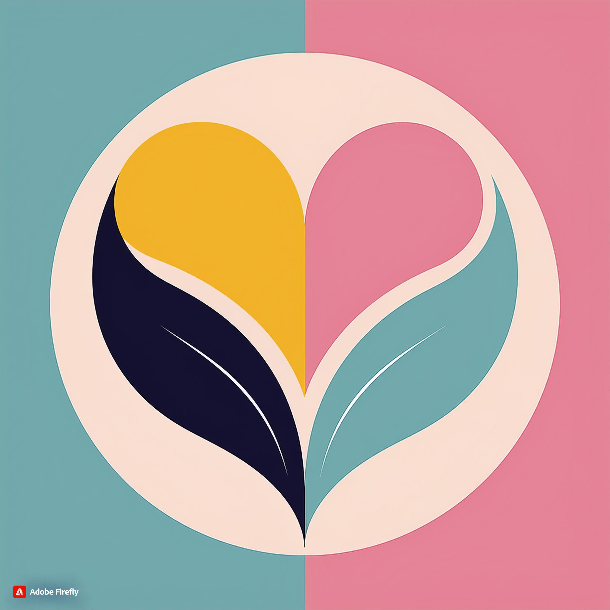

# Logo gerada pelo Adobe Firefly

## Prompt utilizado
"Desenvolva um logotipo que combine uma folha e um coração. A folha deve ser estilizada e pode formar a parte superior do coração ou estar em torno dele. O coração pode ser levemente visível dentro da folha, representando a conexão entre nutrição e cuidado emocional. Utilize as seguintes cores: Verde (#76B947) para a folha, Azul Claro (#A2D9CE) para o coração, e Bege (#F2E9DC) para o fundo. O design deve ser acolhedor e orgânico, destacando uma abordagem de nutrição que considera a saúde emocional e física."

## Resultado

